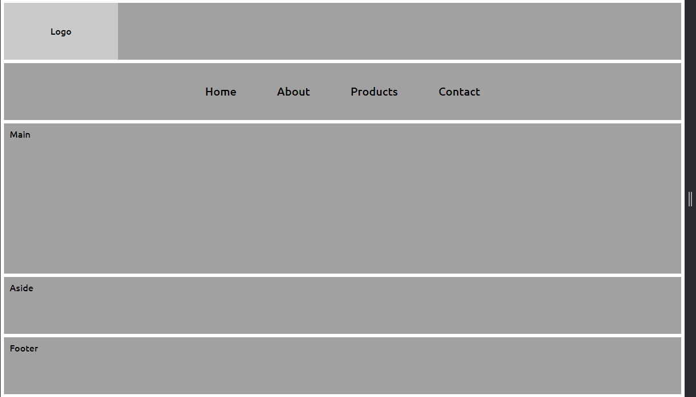
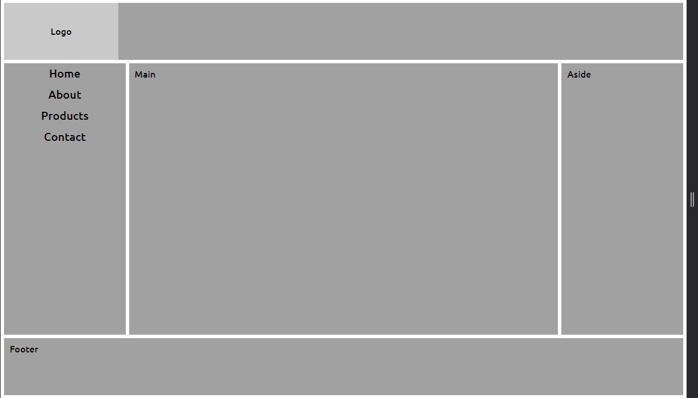
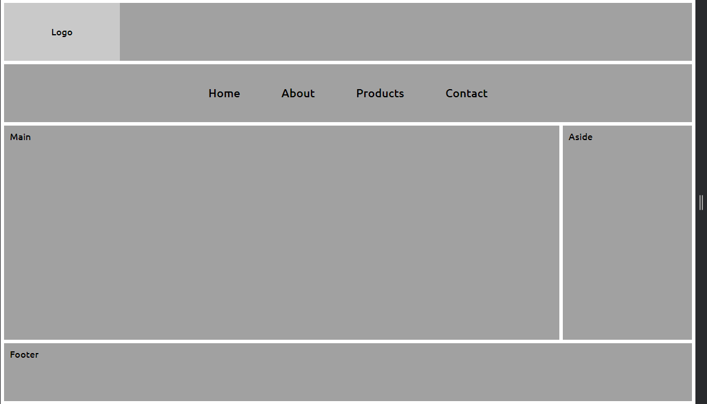
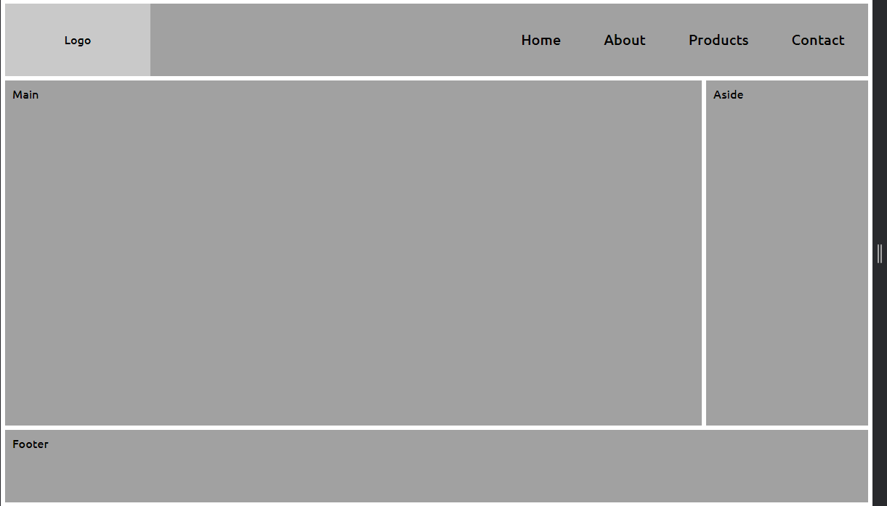
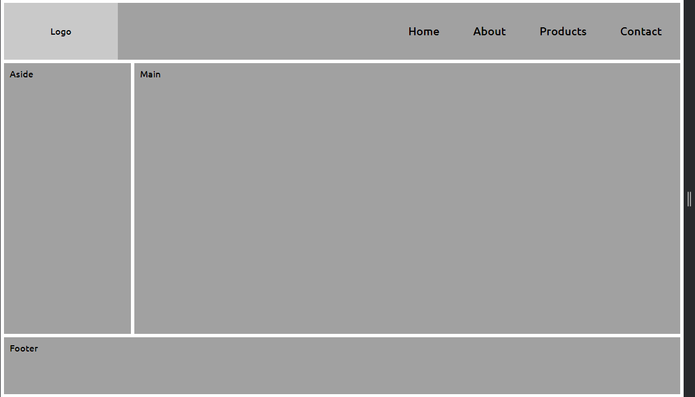

# 5 Layouts de sites mais comuns na Internet

Durante a criação foram utilizadas tags HTML semânticas, propriedade CSS flex, posicionamento de elementos, responsividade e manipulação de CSS com Javascript. Para mais detalhes de implementação, o vídeo está disponível no Youtube.

URL: https://www.youtube.com/watch?v=sSkmBxsaJWg

 

<h2>Layout 1</h2>
 

<h2>Layout 2</h2>
 

<h2>Layout 3</h2>
 

<h2>Layout 4</h2>
 

<h2>Layout 5</h2>
 

